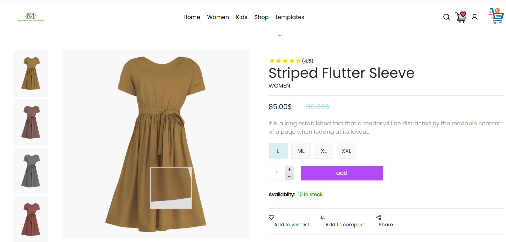
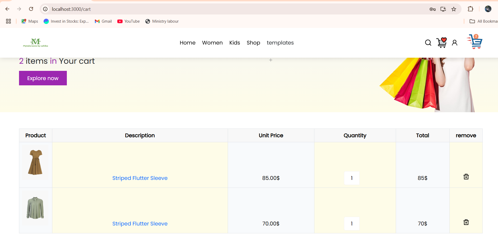
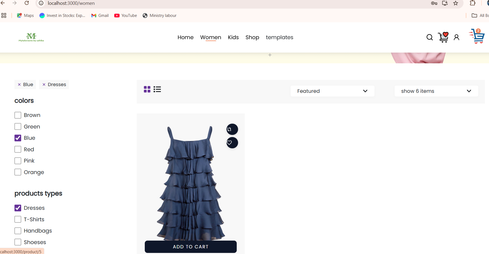

# Mytaylorzone
# Clothing App for Women

This is a *Clothing App for Women* that offers a wide range of clothing options. The application is built using the *MERN stack* (MongoDB, Express, React, Node.js) and styled with *Tailwind CSS*. It provides features such as user authentication, product browsing, cart management, and checkout. The app is fully deployed and accessible online.

---

## Features

- *User Authentication*: 
  - Secure registration and login system.
  - Passwords are hashed using bcrypt for security.

- *Product Catalog*: 
  - Wide variety of women's clothing, including ethnic and western wear.
  - Dynamic product display fetched from the backend.

- *Cart Management*: 
  - Add, remove, and update items in the cart.
  - User-specific cart management stored in MongoDB.
  - Real-time total price calculation and quantity adjustments.

- *Responsive Design*: 
  - Fully responsive layout designed with Tailwind CSS.
  - Optimized for desktop, tablet, and mobile devices.

- *Backend API*:
  - RESTful API for user management, cart operations, and product handling.
  - JWT-based session management for secure interactions.

---

## Tech Stack

### Frontend
- *React.js*: Framework for building user interfaces.
- *Tailwind CSS*: Utility-first CSS framework for fast and responsive design.
- *Axios*: Library for handling API requests.

### Backend
- *Node.js*: Server-side runtime for JavaScript.
- *Express.js*: Lightweight framework for building RESTful APIs.
- *MongoDB*: NoSQL database for storing user and cart information.

---
## Demo

### Screenshot





## Installation and Setup

### Prerequisites
Ensure you have the following installed:
- *Node.js* (v14 or higher)
- *MongoDB* (local or cloud instance)

### Steps
1. Clone the repository:
   ```bash
   git clone https://github.com/your-repo/clothing-app.git
   cd clothing-app
   */
  TaskLearn is an interactive platform where users can add and learn new skills. Each skill comes with a detailed description and related keywords, enabling users to explore chapters and answer AI-generated questions for a comprehensive learning experience.

---

## Features

- **Add Skills**: 
  - Users can add new skills with detailed descriptions and related keywords.
- **Chapters Creation**: 
  - Skills are divided into chapters, each focusing on specific topics.
- **AI-Generated Questions**: 
  - Interactive questions are provided by AI to enhance learning.

---

## Tech Stack

### Frontend
- **React**: Framework for building user interfaces.
- **TailwindCSS**: Utility-first CSS framework for responsive design.
- **Radix UI**: Accessible UI components.
- **React Query**: State management and server state handling.
- **React Hook Form**: Simplified form handling.
- **Zod**: Schema validation for forms.

### Backend
- **Node.js**: Server-side runtime for JavaScript.
- **Vite**: Fast build tool for modern web projects.

### Other Libraries
- **Axios**: For handling API requests.
- **Recharts**: For creating interactive charts.
- **DND Kit**: Drag-and-drop utilities.
- **Embla Carousel**: Responsive carousels.

---

## Prerequisites

Ensure you have the following installed on your system:
- **Node.js** (v16 or higher)
- **npm** or **yarn**
- **Git**

---

## Installation and Setup

1. **Clone the Repository**:
   ```bash
   git clone https://github.com/GRID-R-D/tasklearn-frontend.git
   cd tasklearn-frontend

2. **Install Dependencies**:
   ```bash
   npm install
   
3. **Run the Development Server**:
   ```bash
   npm run dev
